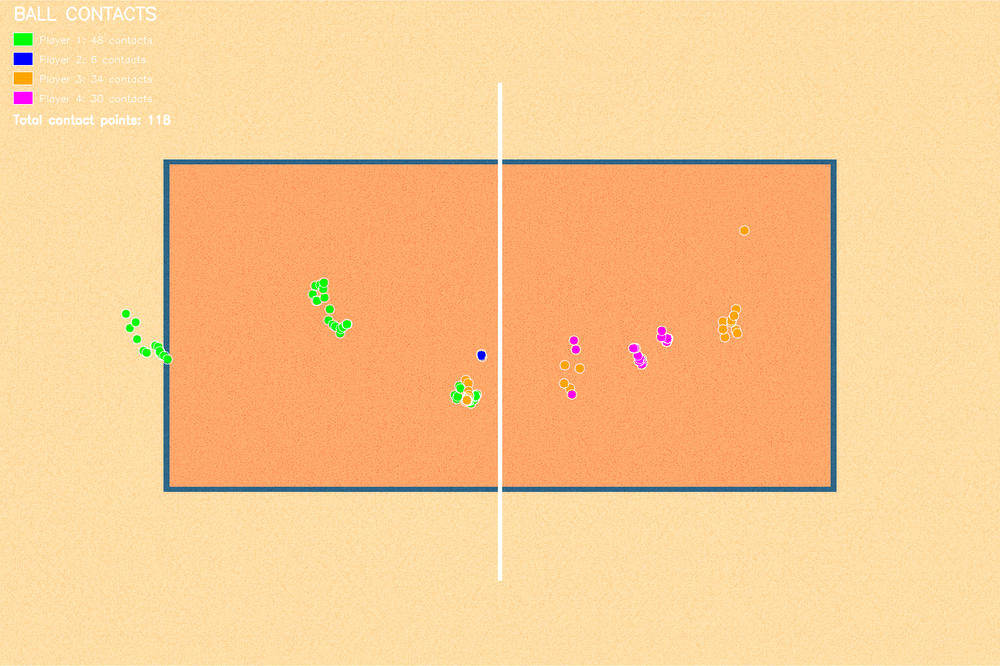

# Beachvolley-Homography

Proyecto de vision por computador para analizar partidos de voley playa desde video. El sistema detecta la pelota, detecta el campo, realiza la homografia hacia una vista cenital y hace seguimiento de jugadores para generar datos accionables y visualizaciones limpias.

Autores: 

 - Miguel Castellano Hernández
 - Gorka Eymard Santana Cabrera
 - Wail Ben El Hassane Boudhar


---

## Presentacion del proyecto
Beachvolley-Homography nace para convertir video real de voley playa en informacion medible: trayectorias, posiciones y eventos clave. La idea es ofrecer una base tecnica lista para analisis deportivo, scouting, metricas de rendimiento y futuras aplicaciones de arbitraje asistido.

Valor diferencial:
- Pipeline completo de deteccion y seguimiento con mapeo a un plano de cancha.
- Salidas en formatos estandar (CSV/JSON) listas para analitica.
- Visualizaciones de tracks sobre video y sobre mapa.

---

## Componentes principales

### 1) Deteccion y seguimiento de pelota
Objetivo: localizar la pelota en cada frame y reconstruir su trayectoria.

Flujo general:
- Deteccion por modelo (YOLO) en cada frame.
- Filtrado por confianza y tamano para reducir falsos positivos.
- Asociacion temporal con criterio de distancia/IOU para construir el track.
- Suavizado opcional de la trayectoria para eliminar saltos.

Detalle tecnico paso a paso:
- Preprocesado: el video se lee frame a frame y se ajusta a la resolucion esperada del modelo.
- Inferencia: YOLO devuelve bounding boxes con clase "ball" y una puntuacion de confianza.
- Filtrado: se descartan detecciones fuera de rango de tamano o con score bajo.
- Seleccion: si hay varias detecciones candidatas, se elige la mas coherente con la posicion anterior.
- Tracking: se enlazan detecciones entre frames usando distancia euclidea y/o IOU.
- Interpolacion: cuando falta una deteccion puntual, se interpolan posiciones para mantener continuidad.
- Suavizado: se aplica una media movil o filtro simple para evitar jitter.

Salida tipica:
- CSV con `frame`, `x`, `y`, `score` y/o un track continuo.
- Video de depuracion con bounding box y trayectoria superpuesta.

Notas:
- La pelota es pequeña y rapida: ajustar el umbral de confianza puede cambiar mucho el recall.
- En escenas con poca luz o mucho blur, conviene priorizar recall y limpiar con post-procesado.

---

### 2) Deteccion del campo y homografia
Objetivo: identificar el campo y mapear cualquier punto del video a una vista cenital (mapa).

Flujo general:
- Deteccion de lineas y/o puntos clave del campo.
- Seleccion de correspondencias entre el plano de imagen y el plano del campo.
- Calculo de homografia con RANSAC o ajuste robusto.
- Transformacion de coordenadas de pelota y jugadores al sistema del mapa.

Detalle tecnico paso a paso:
- Extraccion de bordes: se resaltan lineas blancas del campo con filtros (Canny/threshold).
- Deteccion de lineas: Hough u otro metodo para encontrar segmentos y su interseccion.
- Puntos clave: se identifican esquinas y lineas centrales como anclas geometricas.
- Correspondencias: se asocian puntos del video con los del mapa ideal de la cancha.
- Homografia: se estima la matriz 3x3 que transforma coordenadas de imagen a cancha.
- Validacion: se revisa el error de reproyeccion y se ajustan puntos si es necesario.
- Proyeccion: cualquier coordenada (pelota/jugadores) se transforma a `x_map`, `y_map`.

Salida tipica:
- `map_points.json` con puntos de referencia y metadatos.
- Coordenadas transformadas `x_map`, `y_map` en CSV.
- Imagen/overlay de la cancha con la proyeccion de tracks.

Notas:
- La calidad de la homografia depende de la estabilidad de la camara.
- Se recomienda fijar 4+ puntos bien distribuidos (esquinas y lineas centrales).

---

### 3) Seguimiento de jugadores
Objetivo: detectar jugadores, asignarles IDs y mantener su identidad en el tiempo.

Flujo general:
- Deteccion de jugadores por modelo (YOLO o similar).
- Asociacion multi-objeto con criterios de distancia y/o apariencia.
- Manejo de oclusiones y cambios de escala.
- Proyeccion al mapa mediante homografia para analisis espacial.

Detalle tecnico paso a paso:
- Deteccion: se obtienen bounding boxes de la clase "person".
- Filtrado: se descartan cajas fuera del area de juego o con score bajo.
- Asociacion temporal: se calcula distancia centro-a-centro entre frames consecutivos.
- Asignacion de ID: el mejor match hereda el ID anterior; si no hay match, se crea uno nuevo.
- Oclusiones: se permite una ventana de frames sin deteccion antes de cerrar un track.
- Proyeccion: se usa la homografia para ubicar cada jugador en el mapa.
- Agregacion: se pueden generar mapas de calor o zonas de ocupacion.

Salida tipica:
- CSV con `frame`, `id`, `x`, `y`, `x_map`, `y_map`, `score`, `class`.
- Video con bounding boxes e IDs.
- Mapa con zonas de ocupacion y recorridos.

Notas:
- Si hay cambios bruscos de camara, puede fallar la asignacion de IDs.
- La separacion por equipos puede integrarse mas adelante con color/jersey.

---

## Resultados y salidas
Este repositorio genera (via `beach_volleyball.ipynb`):
- JSON de puntos de campo: `outputs/field/field_points.json`, `outputs/field/map_points.json`
- Tracking de jugadores: `outputs/player_tracking/tracking_data.csv`, `outputs/player_tracking/tracking_summary.json`
- Tracking de pelota (SAM2): `outputs/ball/ball_sam2_track.csv`
- Pelota proyectada a cancha: `outputs/ball/ball_field_trajectory.csv`
- Mapas de trayectorias: `outputs/player_tracking/trajectories.png`, `outputs/player_tracking/trajectory_player_*.png`
- Visualizaciones de pelota: `outputs/ball/ball_contacts.png`, `outputs/ball/ball_trajectory.png`, `outputs/ball/ball_trajectory_field.png`
- Video final con minimapa y contactos: `outputs/complete_tracking_video.mp4`

---

## Como usar el proyecto

### Requisitos
Este proyecto usa Python 3.11+. Las dependencias estan en `requirements.txt`:
- numpy, opencv-python, pandas, matplotlib, tqdm
- torch, torchvision
- ultralytics (YOLO)

Instalacion recomendada:
```bash
python -m venv .venv
.\.venv\Scripts\activate
pip install -r requirements.txt
```

### Rutas de entrada 
- Videos: `resources/VideosAnalisis/*.mp4`
- Mapa de cancha: `resources/beachvolleyballcourt.png`

### Ejecucion 
El flujo principal esta en:
- `beach_volleyball.ipynb`

Abrir con Jupyter o VS Code y ejecutar celda a celda.

### Pesos y modelos
Coloca los pesos en las rutas esperadas:
- `weights/yolo11n.pt` (YOLO)
- `checkpoints/sam2.1_hiera_tiny.pt` (SAM2, opcional)

Notas:
- El notebook usa `configs/sam2.1/sam2.1_hiera_t.yaml` para SAM2. Asegura esa ruta si usas SAM2.
- Si no estan disponibles, el pipeline puede fallar o quedar incompleto.

---

## Indicaciones para imagenes y videos
Los resultados generados por defecto se guardan en `outputs/`. Si quieres documentar el proyecto, deja los recursos visuales en `docs/media/` (sugerencia) y agrega enlaces en estas secciones:

### Capturas del proyecto





### Video final del resultado

[Video final](outputs\complete_tracking_video.mp4)


---

## Vision a futuro
- Integrar re-identificacion para mejorar el seguimiento en oclusiones.
- Separar equipos y roles por color de camiseta y posicion.
- Deteccion de eventos: saque, remate, bloqueo, puntos y errores.
- Panel web con analiticas y exportacion de clips.
- Optimizacion para ejecucion en tiempo real.

---

## Nota Adicional
Para la detección de la bola y el seguimiento se probó inicialmente utilizar un modelo de yolo entrenado con imagenes de pelotas de volley como habíamos observado en el repositorio open-source : 
"https://github.com/shukkkur/VolleyVision?tab=readme-ov-file#%EF%B8%8F-court-tracking" y también probamos a seguir la pelota con detección por bordes y formas. En ambos escenarios los resultados distaban mucho de ser satisfactorios pero contamos con ellos por si se quisiesen consultar. Esto se debe principalmente a que en los clips de video de volley playa la pelota era demasiado pequeña y se movía muy rápidamente.

## Contacto
Para colaboraciones o dudas, abre un issue o escribe a los autores.
